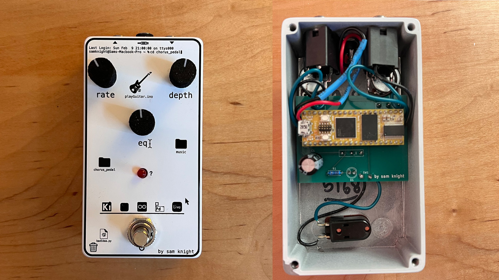

# How to Make a Digital Guitar Pedal

_by Sam Knight_

Welcome! This repository contains documentation and supporting materials for my YouTube course on how to build a digital guitar pedal using the Daisy Seed.

The goal of this course is not to clone a specific pedal, but to teach the full workflow and decision-making process behind designing, programming, and assembling your own digital guitar pedals.

## Table of Contents

- [Course Overview](#course-overview)
- [Prerequisites](#prerequisites)
- [Documentation & Resources](#documentation--resources)
  - [Bill of Materials](docs/bom.md)
  - [Resources & Links](docs/resources.md)
  - [Recommended Learning](docs/recommended-learning.md)
  - [Code](code/)
  - [Hardware](hardware/)
- [Episode Breakdown](#episode-breakdown)

## Course Overview

This course covers many topics, including:

- Setting up the **Daisy Seed** with a breadboard
- Programming a simple **hard clipping and soft clipping distortion**
- Using the **DaisySP library** to program the Daisy
- Making a **drill schematic on Tayda Electronics** for our enclosure
- Making a **full custom PCB in KiCad** with accurate part placements
- Designing a **graphic in Adobe Illustrator** to get **UV printed** onto our enclosure
- Ordering everything and **soldering** it all together

### Final Result

This does not mean it is the exact pedal you will end up with. The purpose of the course is to teach the fundamentals and workflow of digital pedal design, not to produce an identical clone. You are encouraged to experiment, modify, and build something that reflects your own ideas.

## Prerequisites!

This course is intended for beginners, but not all beginners start in the same place. While the course is designed to be approachable, there are areas where having absolutely no prior experience may create friction.

That said, even if you are completely new to this space, the course can still serve as a strong foundation. If your long-term goal is to design audio-related hardware or software, this course will help identify the gaps you may want to fill going forward.

You may find parts of the course challenging if you have no experience with the following:

1. **Basic programming.** I show you how to use the DaisySP library and teach very basic DSP, but if you haven't ever written a single line of code before, there will be confusing moments. I don't go over the very basics of programming in the course, but as long as you have a simple understanding of the building blocks of any programming language, then I think you'll be fine.
2. **Very basic understanding of electrical engineering.** Going forward, if something like a "resistor" means nothing to you, then you may hit a little bottleneck with designing pedals. Don't get me wrong, to design basic circuits like we do in this course, you don't have to design anything honestly, but if you want to keep improving that will be needed moving forward. And if you have zero understanding of wiring up components and things, then there may be moments of the course that get confusing.

## Episode Breakdown

### Episode 1 — Picking Parts

Setting up the Daisy Seed on a breadboard and selecting initial components so we can begin experimenting with knobs, switches, and basic interaction.

### Episode 2 — Basic DSP

An introduction to digital signal processing and the Daisy audio callback. We use these concepts to build simple hard-clipping and soft-clipping distortion effects.

### Episode 3 — DaisySP Library

A walkthrough of the DaisySP library and how to integrate its DSP modules into your projects. We implement a basic chorus effect as a practical example.

### Episode 4 — Enclosure Drill Schematic

Creating a drill schematic using Tayda Electronics so the enclosure arrives pre-drilled and ready for assembly.

### Episode 5 — Circuit Schematic

Designing a simple circuit schematic in KiCad to connect the Daisy Seed with external components.

### Episode 6 — Footprints

Learning how to find existing footprints and create custom footprints using component datasheets.

### Episode 7 — PCB Layout & Routing

Defining the PCB outline, placing components so the board fits correctly inside the enclosure and aligns with the drill schematic, and basic PCB routing and ground plane.

### Episode 8 — Design Review & Ordering

Verifying mechanical fit, checking for common errors, and ordering the PCB through PCBWay.

### Episode 9 — UV Printing & Final Parts Order

Designing enclosure artwork for UV printing and placing final parts orders.

### Episode 10 — Final Assembly

Soldering the pedal together, testing the hardware, and applying finishing touches to the firmware.
